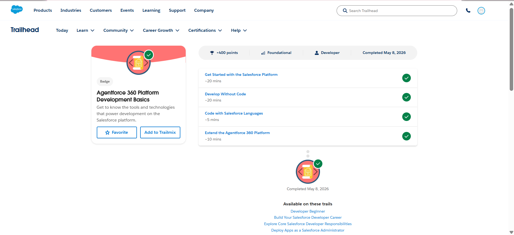
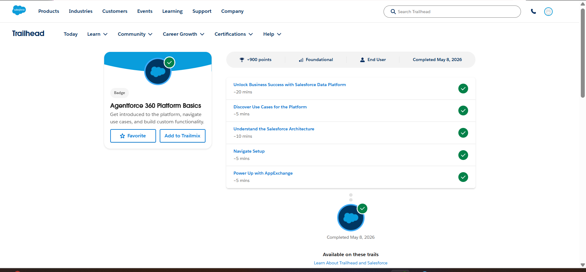

# Day 2 - Salesforce Platform Basics

## Introduction

In this task, I explored the basic concepts of the Salesforce Platform and understood how Salesforce helps organizations build applications with minimal coding. This activity helped me learn about apps, objects, tabs, and the difference between configuration and coding in Salesforce.

---

## 1. What is Salesforce Platform?

Salesforce Platform is a cloud-based application development platform that allows businesses to create, customize, and manage applications without worrying about infrastructure management.

It provides tools for data storage, automation, security, user management, reporting, and application development.

In simple words, Salesforce Platform helps organizations build business applications quickly using both click-based configuration and code-based customization.

### Real-Time Example

For example, a hospital can use Salesforce Platform to create a patient management system where:

- Patient details are stored
- Doctor appointments are tracked
- Medical records are managed
- Notifications are automated

Everything can be managed from a single cloud platform.

---

## 2. Explain the Following

### App

An App in Salesforce is a collection of tools, tabs, objects, and features grouped together for a specific business purpose.

It provides users with a focused workspace to perform their tasks.

### Example

A **College Admission App** may contain:

- Student Applications
- Courses
- Fee Details
- Admission Status
- Reports

This helps staff access everything related to admissions in one place.

---

### Object

An Object in Salesforce is like a database table used to store information.

Each object contains records and fields.

### Example

For a college admission system:

**Student Object**

Fields:

- Student Name
- Email
- Phone Number
- Course Applied
- Admission Status

Each student becomes one record in this object.

---

### Tab

A Tab in Salesforce is a user interface element that gives quick access to objects, records, dashboards, reports, or custom pages.

Tabs make navigation easy.

### Example

In a College Admission App:

- Student Tab → Opens student records
- Course Tab → Opens available courses
- Fee Tab → Opens fee details

Tabs help users quickly move between different sections.

---

## 3. Difference Between Configuration vs Coding

| Configuration | Coding |
|-------------|--------|
| Done using clicks, setup tools, and drag-and-drop features | Done by writing code |
| Faster to implement | Takes more time |
| Requires less programming knowledge | Requires programming knowledge |
| Easy to maintain | Maintenance may be complex |
| Used for standard business requirements | Used for complex business requirements |

### Real-Time Example

**Configuration Example:**

Creating:

- Validation Rules
- Flows
- Approval Processes
- Custom Objects
- Page Layouts

without writing code.

**Coding Example:**

Using Apex or Lightning Web Components when:

- Complex automation is required
- Third-party integrations are needed
- Advanced calculations must be implemented

---

## 4. My System Design (App + Objects + User Interaction)

### System Name: College Admission Management System

For this activity, I designed a simple College Admission Management System using Salesforce concepts.

### App

**College Admission App**

This app helps manage the complete admission process in one place.

---

### Objects

#### Student Object

Stores applicant details such as:

- Full Name
- Email
- Mobile Number
- Date of Birth
- Address
- Admission Status

---

#### Course Object

Stores course information such as:

- Course Name
- Department
- Duration
- Fee Structure

---

#### Payment Object

Stores payment details such as:

- Payment ID
- Student Name
- Amount Paid
- Payment Date
- Payment Status

---

### User Interaction Flow

Step 1:

Admission staff logs into Salesforce.

Step 2:

They open the **College Admission App**.

Step 3:

New student applications are created in the Student Object.

Step 4:

Students are mapped to selected courses.

Step 5:

Fee payment details are updated in the Payment Object.

Step 6:

Staff track admission progress and update statuses.

Step 7:

Reports can be generated for management review.

---

## 5. Screenshots from Trailhead

### Agentforce 360 Platform Development Basics

###  Agentforce 360 Platform Basics

---

## Conclusion

This task helped me understand the fundamentals of Salesforce Platform, including apps, objects, tabs, configuration, and coding concepts. I also learned how Salesforce can be used to design real-world business applications efficiently.